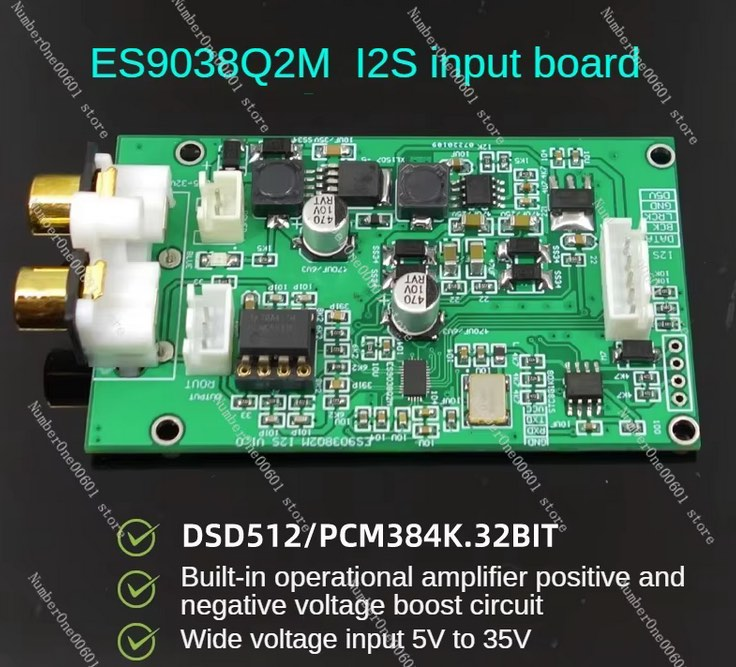
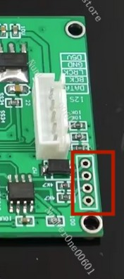

## STC8 MCU FW for ES9038Q2M I2S DAC Board

Custom stc8 mcu firmware for cheap Chinese ES9038Q2M I2S DAC board found on Aliexpress

Search Aliexpress for **1PCS ES9038 I2S input Decoder Board 32Bit DSD512 Upgrade DAC Player** or [direct link](https://www.aliexpress.com/item/1005007245315892.html)

### About

ES9038 registers needs to be initialized upon power-on. This board has STC8 MCU for this purpose. Custom firmware allows to configure ESS chip at your discretion, for example sample bit rate, async/sync mode, filter etc.

### Build

Required dependencies:

- [SDCC - Small Device C Compiler](https://sdcc.sourceforge.net/)

`TOOCHAIN_PREFIX` must be changed in the `Makefile` accordingly pointing to the SDCC installation folder

### Flash

Hardware required:

- CH341 USB to UART programmer

Flash resultine firmware using [stc8prog](https://github.com/IOsetting/stc8prog.git)

Connect CH341 to the following pins:

- GND -> GND
- RXD -> RX
- TXD -> TX
- VCC -> 3V

Upon connecting keep GND or VCC floating and connect it AFTER launching stc8prog to trigger STC8 fw upload mode. Try several times if it does not work at the first try.

~~bash
# stc8prog -p /dev/ttyUSB1 -e -f {a full path to}/es9038q_stc8_fw/build/es9038q_stc8_fw.hex
~~

### FW customization

[fw/es9038q.c](fw/es9038q.c)

**Register values**

~~~c
__CODE uint8_t es9038reg[RegNum][2]={
    {ES9038Q2M_SYSTEM_SETTING, 0x01},
    {ES9038Q2M_INPUT_CONFIG, 0xCC}, //0xCC 32-bit, I2S, DSD, SPD, I2S auto-select
    {ES9038Q2M_DEEMP_DOP, 0x42},
    {ES9038Q2M_GPIO_CONFIG, 0xFF},
    {ES9038Q2M_MASTER_MODE, 0x02}, // async DPLL mode default. set to 0x12 128fs for sync mode
    {ES9038Q2M_SPDIF_INPUT, 0x00}, // 0x20 DATA2 pin for SPDIF input (0x00 = DATA_CLK, default)
    {ES9038Q2M_DPLL, 0x5a}, // 0x5a DPLL config. default
    {ES9038Q2M_SOFT_START, 0x8A},
    {ES9038Q2M_VOLUME1, 0x00},
    {ES9038Q2M_VOLUME2, 0x00},
    {ES9038Q2M_FILTER, 0x80},
    {ES9038Q2M_GENERAL_CONFIG_0, 0x8C},
/* filter values
    0xE0 - brick wall
    0xC0 - corrected minimum phase fast roll-off
    0x80 - apodizing fast roll-off (default)
    0x60 - minimum phase slow roll-off
    0x40 - minimum phase fast roll-off
    0x20 - linear phase slow roll-off
    0x00 - linear phase fast roll-off
*/
};
~~~

Refer to [ES9038Q2M Datasheet](https://manuals.lddb.com/DACs/ESS/ES9038Q2M.pdf) for registers/values

*Faust93 04.04.2025*
